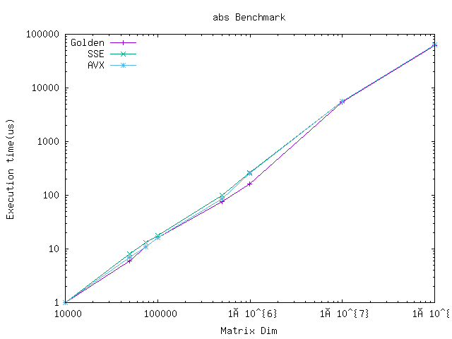
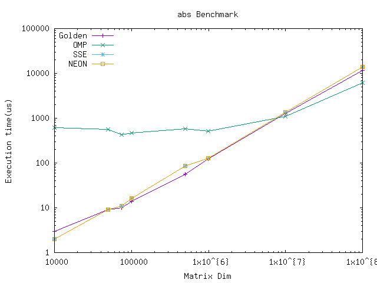
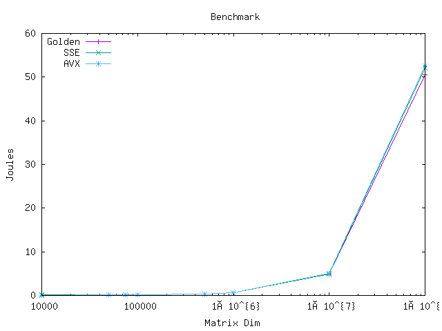

# Energy consumption for Abs Case Study

## Benchmarking

To run benchmarks:

```sh
# 1. Run make to build project
make all
# 2. Run scripts to run benchmarks
# For x86:
./scripts/bench.sh <host>
# For ARM:
./scripts/benchArm.sh <host>
```

-------------

## Performance

### i7-9750H

1. abs function with SSE and AVX


### i7-9750H - Work-station

1. abs function with SSE and AVX



### Apple Silicon: M1 Pro

1. abs function with NEON




## Energy

### i7-9750H - Work-station

1. abs function with SSE and AVX


