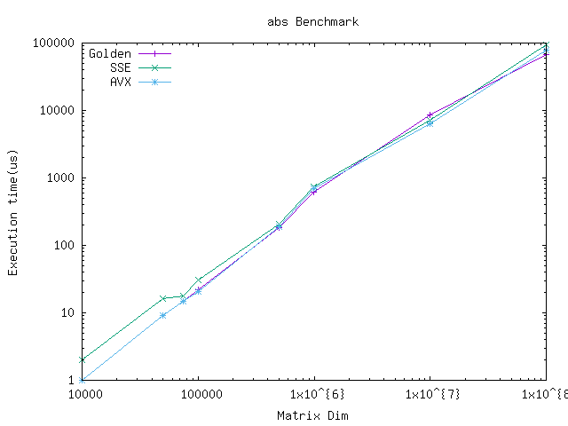

# Energy consumption for Abs Case Study

## Benchmarking

To run benchmarks:

```sh
# 1. Run make to build project
make all
# 2. Run scripts to run benchmarks
bench.sh <host> <executable-to-run>
```

-------------

## Performance

### i7-9750H

1. MinMax with OpenMp and SIMD

